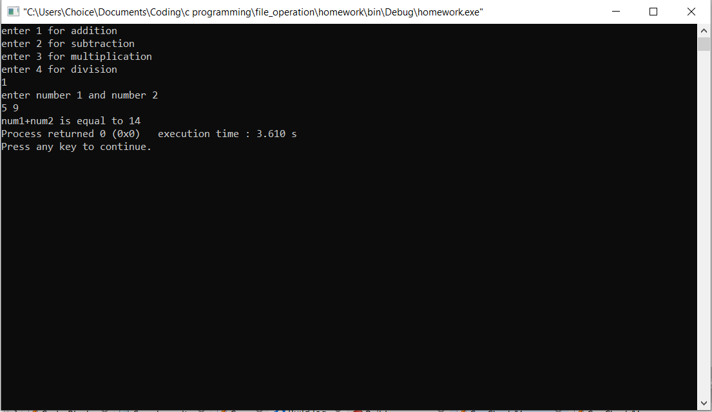
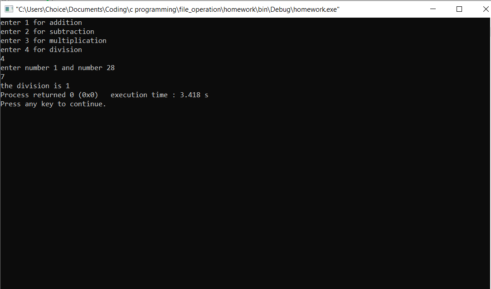

# simple calculator program in c

this is a program written in c to calculate addition, substraction, multiplication, division.

---

### the main code 

inside the main code there is an option for the choose which function of the calculator to be used. 


entering 1 will select addition and 2 will choose substraction and 3 will choose multiplication and 4 will choose division

``` c
int choice;
    scanf("%d",&choice);

    if(n==1)
    {
        add();
    }
    else if(n==2)
    {
        sub();
    }
    else if (n==3)
    {
        /* code */
        mult();
    }
    else if(n==4)
    {
        div();
    }
 
 
 
```
h
the following code will allow user to select which operation the user wants to perform

now the functions which will perform the actual calculation is written 

```c
void add()
{
    int num1,num2;
    printf("enter number 1 and number 2");
    scanf("%d %d",&num1 , &num2);
    int sum=num1+num2;

    printf("num1+num2 is equal to %d",sum);
}

void sub()
{
    int num1,num2;
    printf("enter number 1 and number 2");
    scanf("%d %d",&num1 , &num2);

    if(num1>num2)
    {
        printf("the substraction is %d ",num1-num2);

    }
    else 
    printf("the substraction is %d " , num2-num1);
}

void mult()

{
    int num1,num2;
    printf("enter number 1 and number 2");
    scanf("%d %d",&num1 , &num2);
    printf("the multiplication of number 1 and number 2 is ",num1*num2);
}

void div()
{
   int num1,num2;
    printf("enter number 1 and number 2");
    scanf("%d %d",&num1 , &num2);

    if(num1>num2)
    {
        printf("the division is %d ",num1/num2);

    }
    else 
    printf("the division is %d " , num2/num1);

}
```



the above code will perform the claculations and input output when the methods are called.

